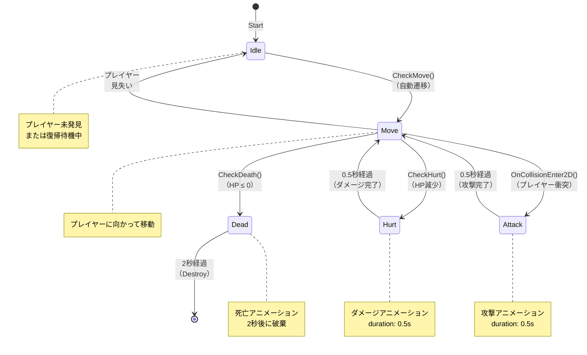

# 敵の状態遷移図 - EnemyFollowController

## 状態遷移フロー

```
       ┌─────────────────────────────────────────────────────────────┐
       │                     [プレイヤー発見]                            │
       │                                                               │
       ▼                                                               │
   Start ──→ Idle ◄─┐                                                 │
       │             │                                                │
       │      CheckMove/自動遷移                              Move ◄──┤
       │             │                         ▲              │      │
       └─────────────┴────────────────────────┘      ┌────────┼──────┘
                                               │       │        │
                   ┌───────────────────────────┤       │        │
                   │                           │       │        │
       ┌──────────▼──────────┐     ┌──────────▼───────┼────────▼──┐
       │ CheckDeath          │     │   CheckHurt      │ Collision  │
       │ (HP ≤ 0)            │     │  (HP減少)        │ (プレイヤー) │
       └──────────┬──────────┘     └────────┬─────────┼────────┬───┘
                  │                        │         │        │
                  ▼                        ▼         ▼        ▼
              ┌────────────┐          ┌────────┐  ┌───────┐
              │   Dead     │          │ Hurt   │  │Attack │
              │（死亡状態） │          │（受撃） │  │（攻撃）│
              │ 2秒で破棄  │          │0.5秒   │  │0.5秒  │
              └────┬───────┘          └───┬────┘  └───┬───┘
                   │                      │          │
                   ▼                      ▼          ▼
                [Destroy]              Move     Move
```

## Mermaid図 ※Markdown Preview Mermaid Supportという拡張機能をいれて



## 各状態の説明

### Idle（アイドル）

- **説明**: プレイヤーが見つからない、または何か他の処理から復帰する状態
- **主処理**: アニメーション停止
- **遷移先**:
  - → Move（CheckMoveで自動遷移）
  - → Dead（CheckDeathでHP≤0検知）

### Move（移動）

- **説明**: プレイヤーを追跡して移動する通常の敵の動き
- **主処理**: プレイヤー方向への移動、速度管理
- **遷移先**:
  - → Idle（プレイヤーが見つからない場合）
  - → Hurt（HP減少検知）
  - → Attack（プレイヤーとの衝突）
  - → Dead（HP≤0）

### Hurt（被撃）

- **説明**: ダメージを受けた時のアニメーション状態
- **処理時間**: 0.5秒
- **主処理**: Hurt アニメーション再生、タイマー計測
- **遷移先**:
  - → Move（0.5秒経過後、自動復帰）

### Attack（攻撃）

- **説明**: プレイヤーと衝突した時の攻撃状態
- **処理時間**: 0.5秒
- **主処理**: Attack アニメーション再生、攻撃処理実行、タイマー計測
- **遷移先**:
  - → Move（0.5秒経過後、自動復帰）

### Dead（死亡）

- **説明**: HP≤0 になった死亡状態
- **処理時間**: 2秒
- **主処理**: Death アニメーション再生、破棄タイマー計測
- **遷移先**:
  - → [破棄]（2秒経過後、ゲームオブジェクト削除）

## 状態遷移の優先度

遷移チェックは以下の順序で実行される：

1. **最優先: CheckDeath()** - HP≤0 の即死判定
   - 他の状態を無視して Dead状態に遷移

2. **2番目: CheckHurt()** - HP減少判定
   - Move/Idle/Attack から Hurt状態に遷移

3. **3番目: CheckMove()** - 移動可能判定
   - Idle/Hurt から Move状態に遷移、または Move/Idle間で遷移

4. **イベント時: OnCollisionEnter2D()** - 物理衝突検知
   - Move状態から Attack状態に遷移

## 実装の特徴

- **フラグ管理を廃止**: `isMove`、`isDead` などのフラグを廃止
- **状態パターン採用**: 各状態を独立したクラス（IEnemyState インターフェース）で実装
- **単一責任**: 各状態クラスは自分の処理のみを担当
- **拡張性**: 新しい状態は新規クラスを追加するだけで対応可能

## ファイル構成

```
EnemyFollow/Scripts/
├── EnemyFollow.cs                 (メインコントローラー)
├── IEnemyState.cs                 (状態インターフェース)
├── EnemyIdleState.cs              (Idle状態)
├── EnemyMoveState.cs              (Move状態)
├── EnemyHurtState.cs              (Hurt状態)
├── EnemyAttackState.cs            (Attack状態)
├── EnemyDeadState.cs              (Dead状態)
└── STATE_TRANSITION_DIAGRAM.md    (このファイル)
```

## 状態遷移の実装例

```csharp
// 状態の変更
private void CheckDeath()
{
    float currentHp = statusManager.BaseStatus.CurrentHP;
    if (currentHp > 0) return;

    ChangeState(deadState);  // Dead状態へ遷移
}

// コントローラー内の状態変更処理
public void ChangeState(IEnemyState newState)
{
    if (currentState != null)
    {
        currentState.Exit();  // 前の状態の終了処理
    }

    currentState = newState;
    currentState.Enter();  // 新しい状態の開始処理
}
```
